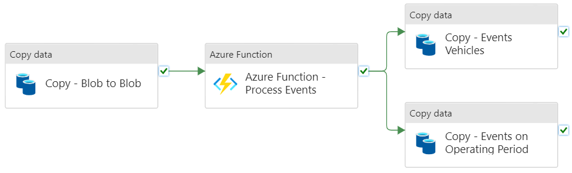
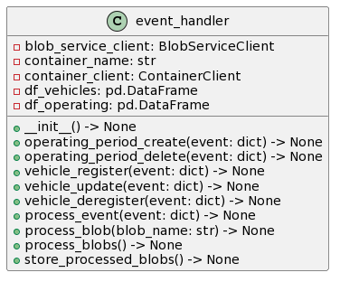

# Data Engineering - Tech Assessment

By Elías D. Nino-Ruiz - https://enino84.github.io/

## Overview

My solution is built on Microsoft Azure, a cloud computing platform, and it involves several services to manage data in the cloud. The *Storage* account service is used as a data lake and employs *blobs* to store the data. The *Data Factory* service is used to copy the information into the data lake and also to trigger an *Azure Function* for data formatting. The Azure Function formats the data and sends it to a *blob storage* in the form of csv files, which will be consumed by a Copy data service from the Data Factory. Finally, a *SQL Server* is used as a data warehouse to store the data in a relational format, after all JSONs have been processed by the Azure Function. Overall, this solution provides a comprehensive and efficient approach to handling data in the cloud, utilizing a variety of Azure services to achieve a robust and scalable architecture.

## General Structure of the solution

To facilitate the task at hand, I first created a resource group named "loka" that contains all the required services. Within this resource group, I created three containers:



- `lokadatacopied` is used to emulate the data source and holds the JSON files provided by you from the `s3://de-tech-assessment-2022` endpoint.

- `lokadata` is used to copy the files from the `lokadatacopied` container. This container is filled by the "Copy - Blob to Blob" process, which emulates the process of copying data from a remote host.

- `lokadataprocessed` stores the results of executing an Azure Function named `TimerTriggerProcessEvent`. This function formats the JSON files into a tabular format suitable for storage in a relational database, or data warehouse. The `TimerTriggerProcessEvent` function is based on two Python files: `__init__.py` and `process_events.py`. The `__init__.py` file contains the main function, which is as follows:

```python
import logging
import azure.functions as func

from .process_events import event_handler


def main(req: func.HttpRequest) -> func.HttpResponse:
    logging.info('Python HTTP trigger function processed a request.')

    p = event_handler()
    p.process_blobs()
    p.store_processed_blobs()
    return func.HttpResponse("* Data processed.", status_code=200)
```

while the Class diagram of `process_events.py` is shown next:



This `__init__.py` first imports the logging module and the azure.functions module, which provides functionality for creating Azure Functions. The function creates an instance of the `event_handler` class named `p` and then calls two methods on it: `process_blobs()` and `store_processed_blobs()`. The `process_blobs()` method processes JSON data from blob files in the `lokadata` container, and the `store_processed_blobs()` method stores the resulting data in the `lokadataprocessed` container. On the other hand, The `event_handler` class contains several methods that handle different events related to the vehicles and their operating periods. For example, the `vehicle_register` method is called when a new vehicle is registered, and it creates a new row in the `df_vehicles` DataFrame with the vehicle's ID, latitude, longitude, registration date, and event type. Similarly, the `vehicle_update` method is called when a vehicle's location is updated, and it adds a new row to `df_vehicles` with the updated location information.

The `process_event` method is responsible for calling the appropriate method based on the event type. For example, if the event is related to a vehicle, it calls one of the vehicle-related methods (i.e., `vehicle_register`, `vehicle_update`, or `vehicle_deregister`), and if the event is related to an operating period, it calls one of the operating-period-related methods (i.e., `operating_period_create` or `operating_period_delete`).

The `process_blob` method is responsible for processing a single JSON blob. It first downloads the blob's contents as a string, then splits the string into individual JSON objects. Finally, it iterates over each JSON object, evaluates it using the `eval` function (which converts the JSON string into a Python dictionary), and passes the resulting dictionary to the `process_event` method to handle the event.

The `process_blobs` method is responsible for processing all blobs in the `lokadata` container. It first retrieves a list of all blobs in the container using the `list_blobs` method of the container client, then iterates over each blob and calls the `process_blob` method to handle the events contained in that blob.

Finally, the `store_processed_blobs` method is responsible for uploading the processed data to the `lokadataprocessed` container in CSV format. It first creates an in-memory byte stream (`io.BytesIO`) containing the contents of each DataFrame as CSV, then uploads each byte stream as a blob to the appropriate location in the container using the `upload_blob` method of the blob client. This Azure function is responsible for processing incoming JSON data, extracting relevant events, and storing them in a relational database. The use of Pandas DataFrames and Azure Blob Storage makes it easy to manipulate the data in memory before storing it, and the structured event handling makes it easy to modify the function to handle new event types in the future.


## Azure Data Factory

